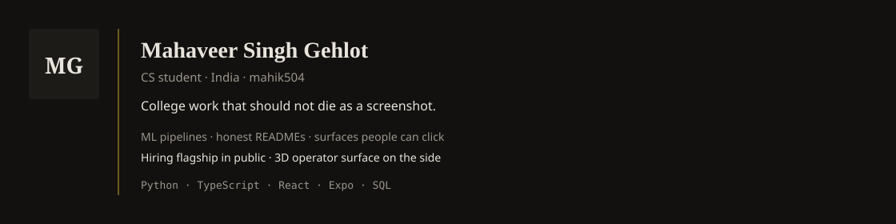

# Mahaveer Singh Gehlot

  <picture>
    <source media="(prefers-color-scheme: dark)" srcset="dark.svg" />
    <source media="(prefers-color-scheme: light)" srcset="light.svg" />
    
  </picture>

CS student. I ship work I can walk through in a viva or an interview. Most college repos die after the screenshot for the report. I don't want mine to.

### What I build

Pipelines I can defend (data in, number out, honest README). Surfaces people can click when the product needs one. Android later on Expo. 3D in the repo (React Three Fiber), not as wallpaper.

### Strongest areas

Python · TypeScript / React · SQL · Git · Expo (when we ship mobile)

I am weaker on frontend polish and CI until a design is locked. That is why Stitch exists. I will not pretend otherwise.

### Featured work

| Project | What it is | Links |
| --- | --- | --- |
| [AstroVerse](https://github.com/mahik504/AstroVerse) | Exoplanet transit pipeline (EvoMoE + AstroLens). Hiring flagship. Numbers go in the README only after the dataset gate passes. | [Repo](https://github.com/mahik504/AstroVerse) |
| [AirLens](https://github.com/mahik504/AirLens) | College Data Visualization GUI. Five tabs, India AQI map, click a city, get a mark and a number. Course work, not the internship pin. | [Repo](https://github.com/mahik504/AirLens) |
| [Evocentric](https://github.com/aryan-dani/Evocentric) | DBMS mini-project that refused to stay a mini-project. Live EV charging ops, built with [Aryan Dani](https://github.com/aryan-dani). | [Repo](https://github.com/aryan-dani/Evocentric) |
| [dsa](https://github.com/mahik504/dsa) | LeetCode / HackerRank with notes I can defend. Practice, not a product. | [Repo](https://github.com/mahik504/dsa) |
| [orchestra-workflow](https://github.com/mahik504/orchestra-workflow) | How I run Cursor + Antigravity. Template, not a product. | [Repo](https://github.com/mahik504/orchestra-workflow) |

No live URLs of *my* chrome yet. I will not invent them.

### Currently

- **AstroVerse** — hiring flagship (ML, public).
- **LYRA** — personal 3D operator HUD on a forked orb. Credit to Sagar Tamang for the scene. Not a pin.

### Hackathons / research

IIIT Pune hackathon: **XplainAI** (finals, repo still private until it is a case study). SIH this year is the next named event — one wow path, not a plugin pile.

### Stack I actually use

### Elsewhere

LeetCode, HackerRank, LinkedIn — URLs go here when they exist. No invented stats.

### Contact

Issue on a public repo, or the email on this GitHub profile.

### License

MIT. See [LICENSE](LICENSE).

Header SVG: `python generate_card.py` when facts change. No daily bot.
